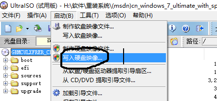
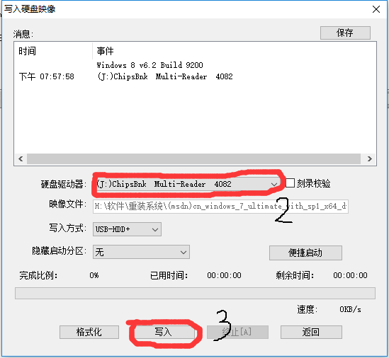
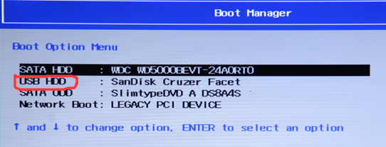
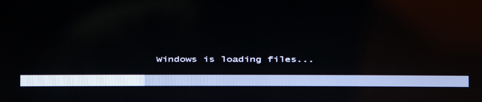
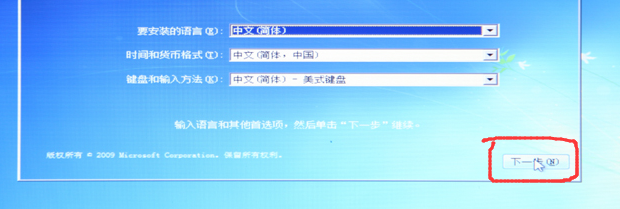
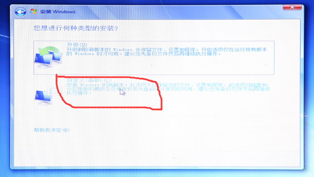
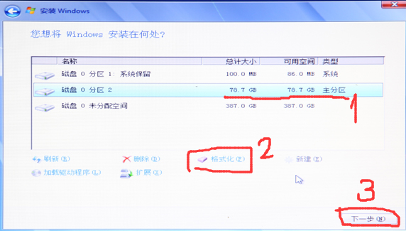
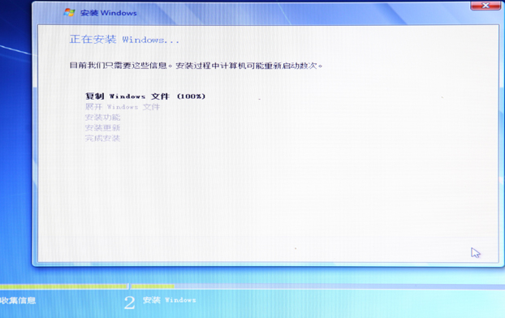

#U盘装系统
---
@zhoufly	2016/4/22 19:45:21 
**准备工作**：
- [UltraISO](http://w.x.baidu.com/alading/anquan_soft_down_ub/11522)
- [win7官方镜像包](http://pan.baidu.com/s/1i52K5Rv)
提取密码：iztw
- [驱动精灵万能网卡版](http://file.mydrivers.com/DG2015Setup_1185E.exe)
- 4G容量以上的U盘（里面的数据需要清空）
---
##映像写入U盘
1.下载win7官方镜像包，用UltraISO打开 -> `继续使用` -> `启动` -> `写入硬盘映像` ->选择`硬盘驱动器`为你的U盘（名字里面有容量大小）。然后点击`写入`（软件会提醒你是否要格式化U盘，单击确定），等待消息栏显示100%完成，结束。

-----
2.将U盘查到电脑上，开启电脑，立即长按F12（选择启动项，有的电脑是F2），选择USB...启动，这时候就出现了Win7安装界面。

3.若此时出现`windows is loading files`文字，就说明之前的操作都是对的。

4.出现安装界面开始安装，点击`下一步`

5.一直点“下一步”知道出现“你想进行何种安装？”，选择下面一种

6.会出现很多个盘的列表，其中有一个显示的是“`主分区`”，你的电脑应该显示`总计大小`为50GB左右，`可用空间`基本上为0，点击`格式化`，完成后选择`下一步`

7.出现下面这个界面，说明前面的操作都是正确的。

8.剩下的就是等待，电脑在期间会重启好几次。最后就全部完成了

##后续工作
1.进入桌面的时候是上不了网的（网卡驱动没有），这时候安装驱动精灵万能网卡版（安装的时候注意取消掉它给你安装的流氓软件）。
2.安装完成后开始让它自动匹配网卡，完事后连上网让它安装其他的驱动（主要是显卡）。
3.驱动安装完成后卸载驱动精灵。

##注：
- 上面的操作没有涉及拓展C盘的操作，主要原因是这部分操作对于新手来说太危险了，所以到最后C盘还是50GB左右。
- 将电脑中**特别重要**的文件实现转到移动硬盘里**备份**，因为万一操作失误，这些数据就没有了！

##参考教程：
http://wiki.jd.com/knowledge/6699.html
http://jingyan.baidu.com/article/5552ef4712d5da518efbc96e.html

